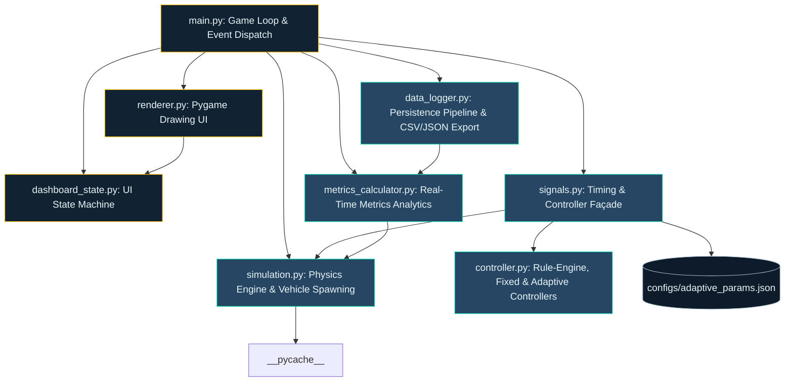

# Architecture Component Diagram

This document contains a Mermaid component diagram showing the module boundaries and relationships within the UrbanFlow system.

---

## Component Responsibilities

1. **`main.py` (Game Loop)**: Ticks the clocks, polls keyboard/mouse events, updates the active signal controller, updates metrics, invokes the renderer, and handles clean shutdowns/auto-exports.
2. **`simulation.py` (Physics)**: Manages vehicle positions, vehicle queuing distance checks, speed state updates, turning geometry rotations, stop line checks, and active vehicle sprite pools.
3. **`signals.py` (Façade)**: Loads parameters, validates ranges, exposes the current green/yellow active light states to renderer, and manages timing countdown calculations.
4. **`controller.py` (Rules)**: Houses the logic for `FixedTimeController` and `AdaptiveController` (the prioritized rule evaluation engine evaluating `WaitTimeThreshold`, `QueueLengthExtension`, `EarlyTermination`, etc.).
5. **`metrics_calculator.py` (Analytics)**: Pure Python engine checking rolled wait/travel/queue metrics in a sliding time window.
6. **`data_logger.py` (Persistence)**: Handles formatting of snapshots to CSV/JSON tables, secure path validation, and computes improvement percentages.
