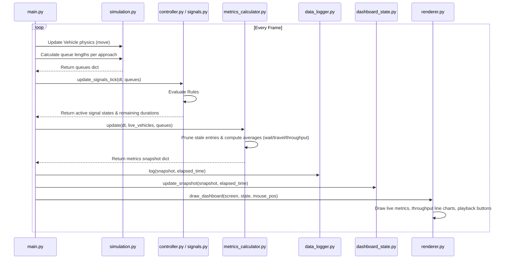

# Data Flow Diagram

This document illustrates how data flows throughout the UrbanFlow system during a single frame update.

## Real-Time Frame Update Flow

---

## Key Pipelines

1. **Simulation State to Metrics**:
   - `simulation.py` maintains the collection of active vehicle objects.
   - On every tick, `main.py` extracts a list of live vehicles and a dictionary of queue counts (number of stopped vehicles behind the stop-lines).
   - This information is fed to `MetricsCalculator.update()`, which tracks birth/crossing milestones.

2. **Controller Decisions to Signals**:
   - Queue sizes are sent to `signals.py` which passes them to the active controller.
   - The adaptive controller evaluates rules sequentially. The resulting light configurations are propagated back to the module-level state in `signals.py` and applied to the Pygame visualization.

3. **Snapshots to Dashboard**:
   - The aggregated KPI dictionary is consumed by `DashboardState` to maintain sample buffers.
   - The rendering surface reads the values and paints the sidebar widgets.

4. **Persistence & Export**:
   - Snapshots are logged to `DataLogger.records` in memory.
   - Clicking "Export CSV" or quitting the app triggers `CSVExporter.export()`, which validates paths against path traversal vulnerabilities and writes rows.
